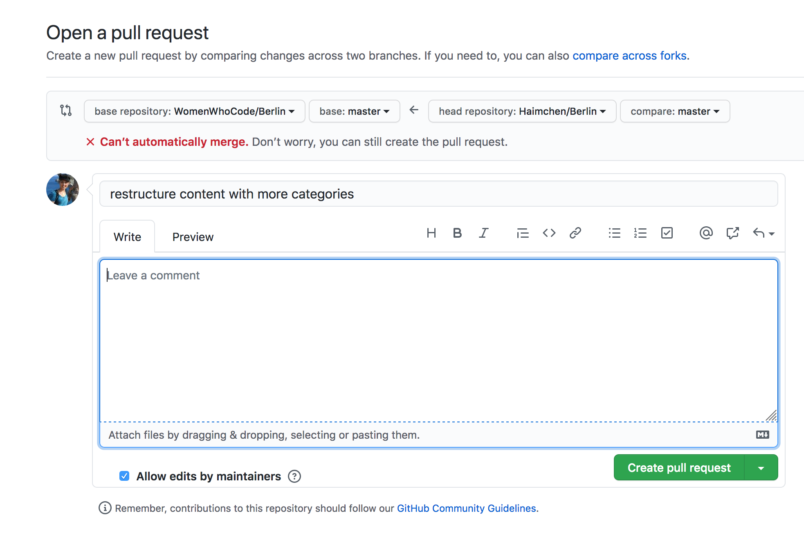

# Women Who Code Berlin

This repository (repo) contains a collection of resources collected for and during our [Hack Evening](https://www.meetup.com/Women-Who-Code-Berlin-Germany/) event series.
It is designed to help anyone who is looking to learn and improve their coding skills to find tutorials, resources, and inspiration.

## How can I contribute?

We love contributions!
We would like to extend this collection further to contain all kinds of resources related to all programming languages, frameworks, general programming knowledge, and IT careers.

Your contributions are more than welcome. If you have anything you liked and found useful, please share it with us:

### What to contribute?

Please be sure to check out the existing resources and also look at our [Content Guidelines](#content-guidelines) to learn more about what types of content we like and what information should be provided.

If you are motivated to help out, but are not sure where to start or what to do, you can also check out the open [Issues](https://github.com/WomenWhoCode/Berlin/issues). These are a collection of tasks that we (or others) think should be done in order to improve this repository. 

Maybe there is something open that would be perfect for you? If you do start working on an issue, it is recommended to comment on the issue to let others know about your work. This can help avoid duplicate work :)

### Contribution Step by Step Guide
The original repository is owned by Women Who Code, only members of the WWC organization can make changes. 
You can contribute meaningful content to an existing repo with the following steps: create a fork (clone / copy the repo into your github account), make your changes and updates, and finally create a Pull Request (submit your changes to the repository owners).

##### Create a github account
To add your contribution to this repository you will need a **Github account**.
You can sign up for free at [https://github.com/join](https://github.com/join).

##### Create a fork
If you have an account and you are signed in, you can create your own **fork** of this repo. (Learn more about forks [here](https://guides.github.com/activities/forking/)).

Click the button labelled "Fork" in the top right corner, this adds a copy of the repo to your github account, with your username as the creator of the (forked) repo. 

You might see a popup that asks you where to create the fork if you are part of any organization - select your personal account.

This means you have your own copy of the repository which you are allowed to freely edit and add to. When you commit changes and save your edits, the changes are made to your fork.

If all the contributions were only spread across different individuals' forks, it would not be very useful.
So how do your changes get updated into the original repository? You create a pull request.

##### Create a Pull Request
You "propose" your changes to us, the owners of the original repository, by creating a **pull request** (often abbreviated as "PR").

In your forked repository, once you have finished making your edits, select the "Pull Requests" tab, then click the button "New Pull Request" (green button in the top right).
You will see a new view where you can select the repositories and branches.

By default it should show `WomenWhoCode/Berlin` as the base repositiory and your fork (`\<YourUsername\>/Berlin`) as the "head repository".

The branch for the base should be master and for your repo it is the branch where you made the changes (if you did not create a branch, it will be master).

Continue by giving your pull request a title that helps us to know what changes it contains.
Ideally, you can also add at least a little bit of detail to the description of the PR.
When you are done, submit the pull request by clicking the green "Create Pull Request" button.

We receive a notification about the new pull request and can have a look at the changes you proposed.
We can then **merge** the changes from your PR to the original repository.
This means they will become part of the original repositiory and you will officially be a contributor.
You may delete your fork afterwards or keep it around for your next contribution.

Congratulations, you have shared your knowledge & tips with our community and potentially the whole world!

### Tips

To make sure everything goes smoothly, here are a few more tips:
- If you create Pull Requests, try to make sure that your fork is up to date with the master branch of this repo.
- If you intend to work on a task where we have an open issue, please make a comment on the issue to let everyone know what you are doing.
- If you need personal support or have any questions, join our slack channel [WWCode-hacknights](http://bit.ly/WWCHackEveningsSlack) (What is [Slack](https://slack.com/resources/slack-101/what-is-slack)?)

### Content Guidelines

We are happy to include any contributions: tutorials, guides, (free) (e)books, video courses, online exercises, ...
Take a look and see if your resource fits any of the existing categories and/or sub-categories. 

If you think the appropriate category is missing, add it.

If you are not sure where your resource belongs, you can also [create an issue](https://github.com/WomenWhoCode/Berlin/issues/new) to ask about it. Or ask in the our [slack channel](http://bit.ly/WWCHackEveningsSlack).

Ideally you will not only add a link, but also a little bit of information:
- What is it exactly? Try to describe it in a sentence or two.
- Why do you like it / or think it is useful?
- A link to the resource (Learn about how to create a clickable link in this [markdown guide](https://www.markdownguide.org/basic-syntax#links))
